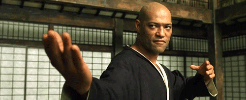
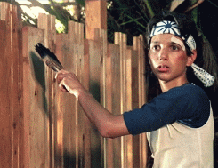

# Coding Dojo

Este é um repositório pessoal voltado exclusivamente para a pratica de **coding dojo** entre amigos, sinta-se a vontade para fazer fork, download, ou sugerir novos desafios.

## Sobre:
**Coding Dojo** é uma reunião em que várias pessoas se reúnem para trabalhar coletivamente em um desafio de programação. Eles estão lá para se divertir e se envolver na por meio da **[prática deliberada](https://g1.globo.com/educacao/noticia/2019/08/25/como-dominar-novas-habilidades-com-a-pratica-deliberada.ghtml)**, a fim de melhorar suas habilidades.

## Objetivos:
* Melhorar o seu conhecimento em uma linguagem / framework
* Aprender uma nova linguagem / framework
* Práticar habilidades de um desenvolvedor (TDD, BDD, pair programming)

## Code Kata
> Um kata é um exercício de karatê, em que você repete uma forma muitas e muitas vezes, fazendo pequenas melhorias em cada uma.
> 

* Você precisa tentar quantas vezes for necessário e se sentir confortável **cometendo erros**.
* Busque feedback sempre que puder, para que você possa melhorar.
* O objetivo do kata **não é** chegar a uma resposta correta ou solucionar o problema. O ponto é o que **você aprende ao longo do caminho**.

## TDD

### Regras do TDD
> 1. **Comece com o teste:** Somente comece a escrever o `código de produção` **após seu teste automatizado falhar**.
> 2. Apenas **1 teste falhando** por vez.
> 3. Escreva **pequenos** testes.
> 4. Escreva apenas o `código de produção` suficiente para fazer os **testes falhando**, passarem. **Nenhum código a mais**.
> 5. **Implemente primeiro o algoritmo mais simples**. Refatore-o depois, quando você identificar padrões.
> 6. Não se esqueça de **refatorar**.
> 7. Refatore seus testes também!
> 8. Não refatore seu código enquanto seus testes estiverem falhando. Faça-os passar antes.

## Pair-Programming

> É uma técnica de desenvolvimento de software ágil na qual duas pessoas programadoras trabalham juntas em uma única estação de trabalho.
>
### Papéis
* **Piloto** - Escreve o código
* **Co-piloto** - Revisa cada linha de código e interage com o piloto.

Os dois programadores alternam os papéis constantemente.

## Requisitos
#### IDE
* [Visual Studio Code](https://code.visualstudio.com/)
#### Extensões obrigatórias
* [Live Share Extension Pack](https://marketplace.visualstudio.com/items?itemName=MS-vsliveshare.vsliveshare-pack)
#### Extensões opcionais
* [Jest](https://marketplace.visualstudio.com/items?itemName=Orta.vscode-jest)
* [Jest Snippets](https://marketplace.visualstudio.com/items?itemName=andys8.jest-snippets)

## Contribuidores
-   André Daniel [andredaniel](https://github.com/andredaniel)
-   Daniel Gomes [Danielgomesp](https://github.com/Danielgomesp/)
-   Kalleu Oliveira [xKalleu](https://github.com/xKalleu)
-   Vinícius Ribeiro [ViniciusVinna](https://github.com/ViniciusVinna)
